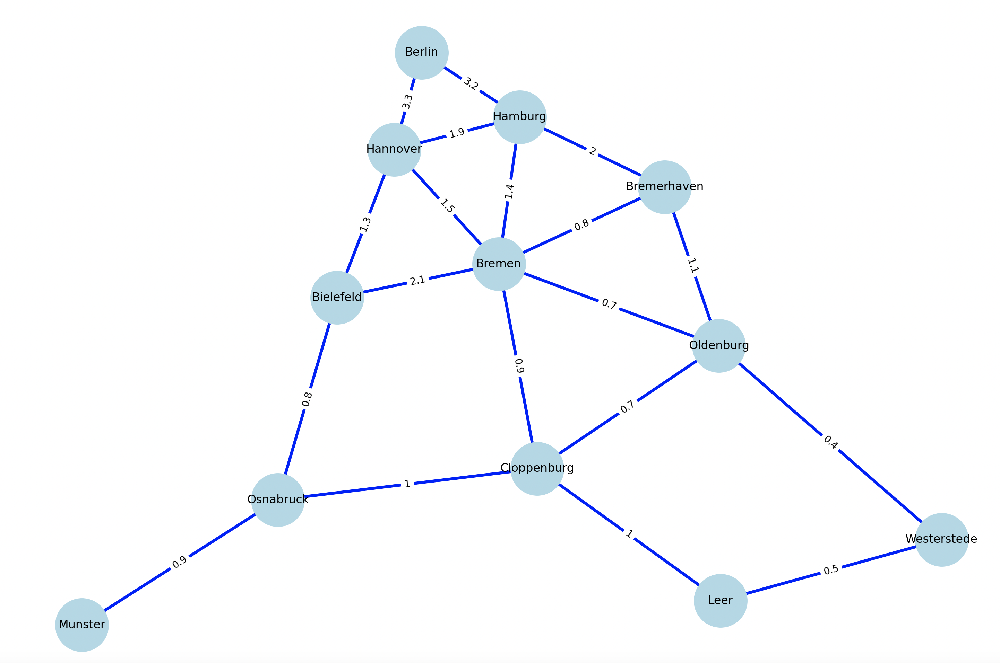
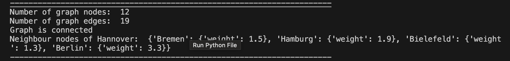
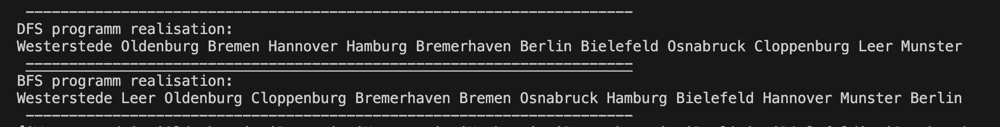
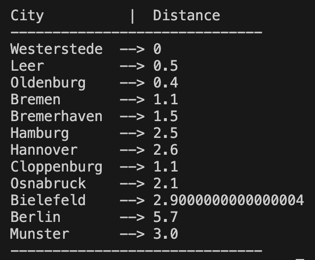

# goit-algo-hw-06

Graph realisation with netwrokX library. BFS and DFS search methods. Dijkstra's algorithms for finding the shortest path between two nodes realisation.

# North Germany cities map graph

# Short graph analisys

# Depth First Search and Breadth First Search

As we see from the result Depth First Search algorithm starts at the root node and explores as far as possible along each branch before backtracking (as far in depth). And the Breadth First Search algorithm starts at the root node and explores all nodes at the present level before moving to the next one (as far in breadth)

# Dijkstra algorithm for finding the shortest path for the given graph

